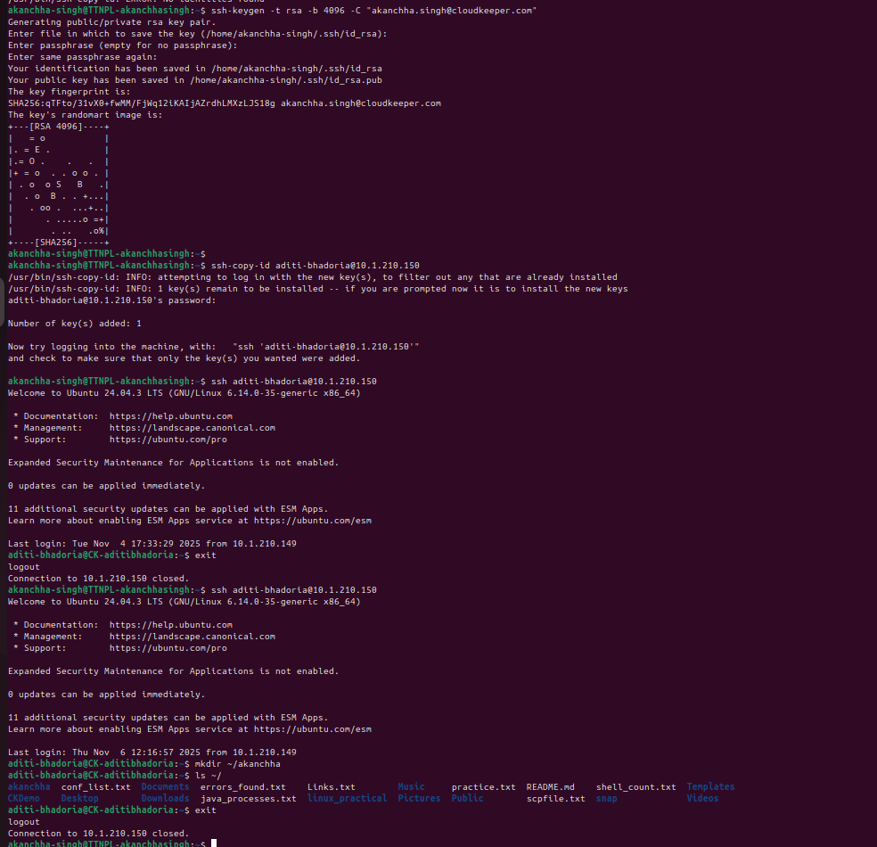
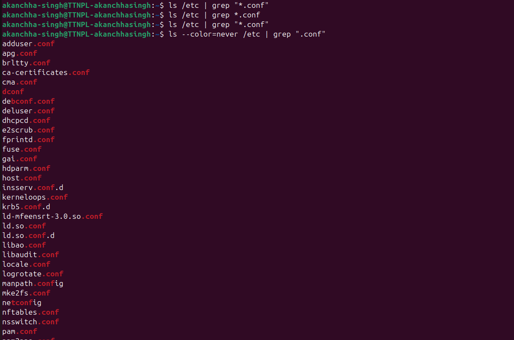
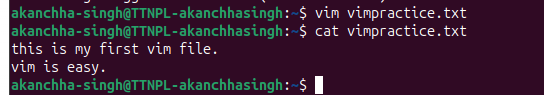
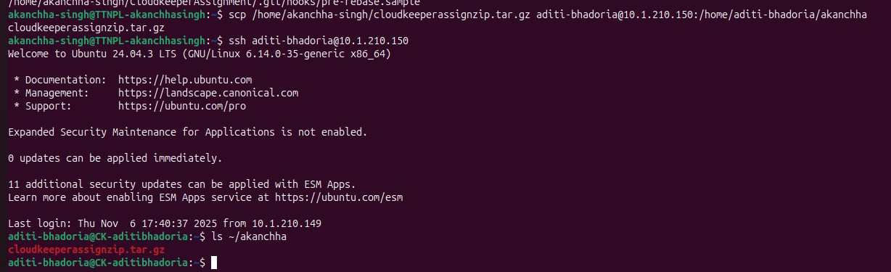

# Linux Assignment

---

## **Q1. Find and terminate the top memory-consuming process on your system**

```bash
akanchha-singh@TTNPL-akanchhasingh:~$ top
```
The `top` command displays a dynamic, real-time view of:
- CPU usage  
- Memory usage  
- Running processes  
- System load  

It is similar to **Task Manager** in Windows.  
- Press **Shift + M** → Sort by memory usage  
- Press **Shift + P** → Sort by CPU usage  

To terminate a process:
```bash
akanchha-singh@TTNPL-akanchhasingh:~$ kill 4675
```
`kill <PID>` sends the default **SIGTERM (signal 15)**, requesting the process to terminate gracefully.

---

## **Q2. Create a user named devops and grant them sudo privileges**

```bash
akanchha-singh@TTNPL-akanchhasingh:~$ sudo adduser test
```
The `sudo` command allows authorized users to execute commands with superuser (root) privileges.

Check user groups:
```bash
akanchha-singh@TTNPL-akanchhasingh:~$ groups test
```

Grant sudo privileges:
```bash
akanchha-singh@TTNPL-akanchhasingh:~$ sudo usermod -aG sudo test
```
- `-a` → append the user  
- `-G sudo` → add to the sudo group  

**User credentials:**
```
Username: test
Password: test123
```

---

## **Q3. Connect to a remote server, create a directory, and copy files using SCP**

```bash
akanchha-singh@TTNPL-akanchhasingh:~$ ssh aditi-bhadoria@10.1.210.150
aditi-bhadoria@CK-aditibhadoria:~$ mkdir ~/linux_practical
aditi-bhadoria@CK-aditibhadoria:~$ ls
aditi-bhadoria@CK-aditibhadoria:~$ exit
akanchha-singh@TTNPL-akanchhasingh:~$ scp /home/akanchha-singh/Documents/practice/a1.txt aditi-bhadoria@10.1.210.150:/home/aditi-bhadoria/linux_practical/
```

---

## **Q4. List all active processes and save those containing “java” into a file**

```bash
akanchha-singh@TTNPL-akanchhasingh:~$ ps aux | grep 'java'
```

Explanation:
- `ps` → shows running processes  
- `a` → all users  
- `u` → detailed info (user, CPU, memory)  
- `x` → background processes  
- `|` → pipes output  
- `grep 'java'` → filters only lines containing “java”

---

## **Q5. Generate an SSH key pair and configure it for two remote servers**

*(Command steps to be executed as per server configuration.)*

---

## **Q6. Find all lines containing “error” in /var/log/syslog and redirect to a file**

```bash
akanchha-singh@TTNPL-akanchhasingh:~$ grep -i "error" /var/log/syslog > errors_found.txt
```

Explanation:
- `grep "error"` → searches for the word “error”  
- `/var/log/syslog` → log file  
- `>` → redirects output  
- `errors_found.txt` → output file

---

## **Q7. Find all `.conf` files in /etc, sort them alphabetically, and save to conf_list.txt**

```bash
akanchha-singh@TTNPL-akanchhasingh:~$ ls /etc | grep ".conf"
```

Explanation:
- `ls /etc` → list all files in `/etc`  
- `grep ".conf"` → find `".conf"`  in all the output resturned
- `|` → pipe output  


---


## **Q8. Display total number of unique shell types in /etc/passwd and save to shell_count.txt**

```bash
akanchha-singh@TTNPL-akanchhasingh:~$ cat /etc/passwd | cut -d: -f7 | sort | uniq | wc -l > shell_count.txt
akanchha-singh@TTNPL-akanchhasingh:~$ cat shell_count.txt
5
```

---


## **Q9. Explore vi/vim for  Creating a text file. Understand cursor movement, switching input mode (append, insert etc), deleting command, pasting content, undo , redo ,search , save and quit operations in vim.**

- in terminal write vim filename.txt
- press i to enter insert mode
- write the content
- press esc to enter normal mode 
- explore j(move down), k(move up), l(move right), h(move left)
- write :wq
- enter 
- this make it come out of normal mode to terminal
- use cat to see the content of file



---

## **Q10. Reset the current user password and reboot the system from shell**

- login as test user
- open terminal
- enter command passwd
- enter current password 
- enter new password
- re-enter new password

- enter sudo reboot
- login again with new password


---

## **Q11. Zip the content of your home directory via tar and send it via scp to other person laptop. Unzip the content on other person laptop via tar.**

to zip the file
tar -czvf cloudkeeperassignzip.tar.gz ~/CloudkeeperAssignment/



---

## **Q12. Install and setup applications via apt: mysql, postman, docker, dbeaver**

```bash
sudo apt update
sudo apt install mysql-server docker.io  -y
```
Postman can be installed manually or via snap:
```bash
sudo snap install postman dbeaver-ce 
```