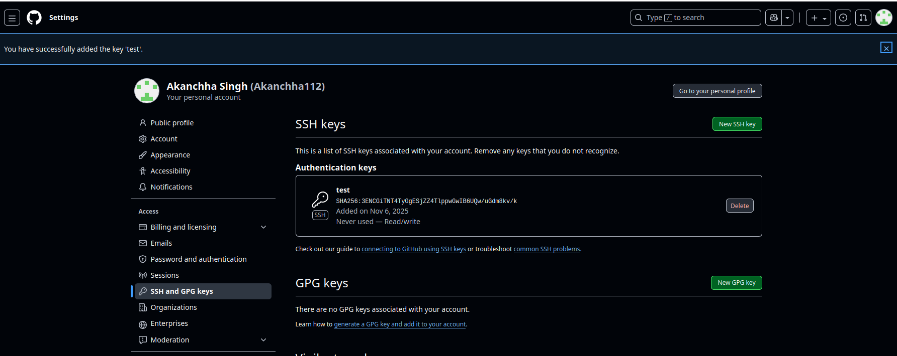
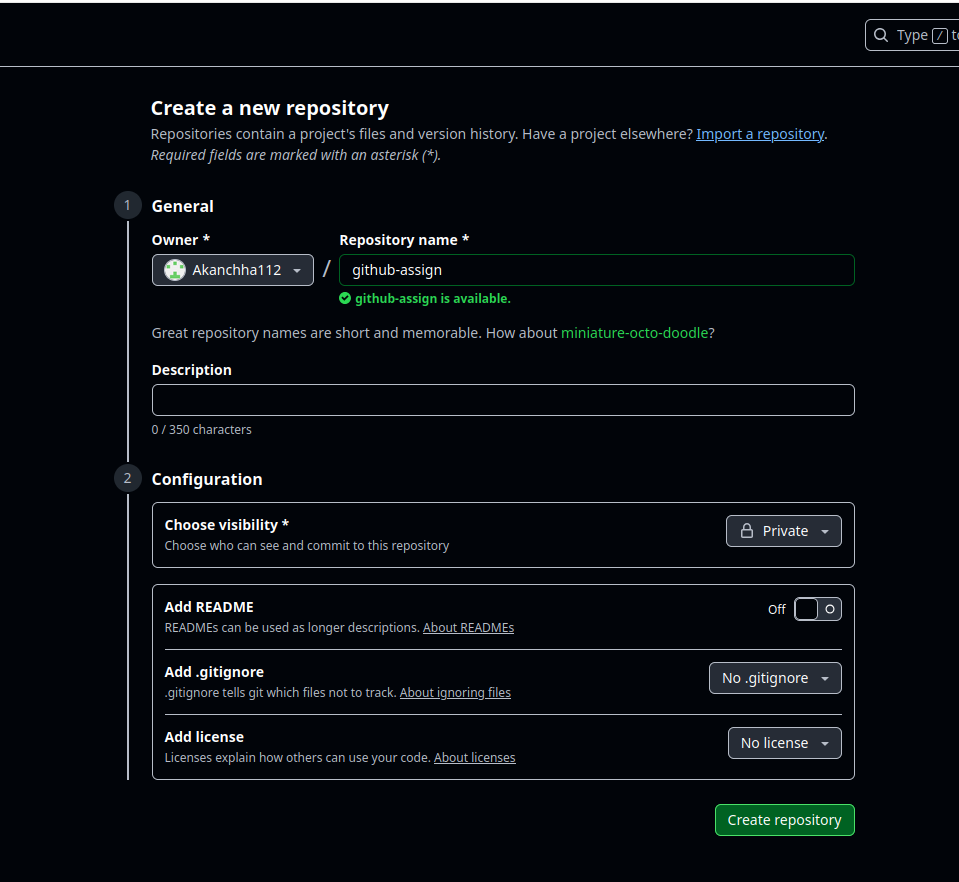
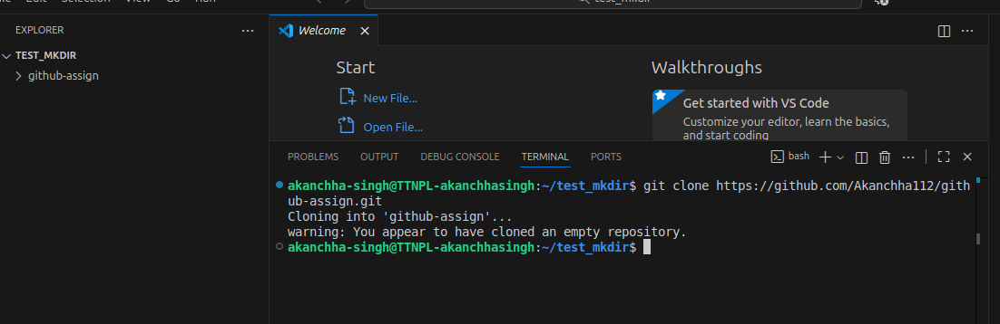
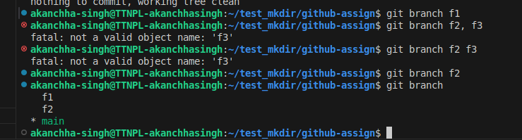
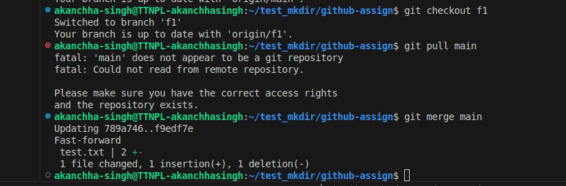

Q1. 
open terminal get sshkey using command and copy it  
cat ~/filename.pub
Go to https://github.com/settings/keys in any browser
Click on generate new SSH key
enter title, select authentication or signing key and then click on add ssh key



Q2. Create a repository on github account.
go to https://github.com/Akanchha112?tab=repositories in a browswer
click on new and enter repository name and other parameters
click on create repository



Q3. Clone the above repository on your local from github. 
copy https link from the repository 
create a folder on local 
open it in vs code 
open terminal 
write git clone https://github.com/Akanchha112/github-assign.git



Q4. Create a new file, say test.txt, in main/master branch. Make some changes to this file and commit the changes.
create a test.txt file
git add . - add all the cahnges to staging
git commit -m "message" - add all the changes to local repo
git push - push the changes to github


Q5. Create two branches from main/master branch, say f1 and f2.
create branches using command git branch branch_name



Q6. How can you resolve a merge conflict in Git, provide an example.




Q7. Show how divergence occurs in a branch.


### Q8. Difference between `git init` and `git clone`

| Aspect | `git init` | `git clone` |
|---------|-------------|-------------|
| **Purpose** | Initializes a new, empty Git repository in the current directory. | Creates a local copy of an existing remote repository. |
| **Connection to Remote (GitHub)** | Does **not** connect to any remote by default; you must manually add one using `git remote add origin <url>`. | Automatically connects the local repository to the remote it was cloned from. |
| **Remote URL Requirement** | No URL required. | Requires a repository URL (HTTPS or SSH). |
| **Folder Creation** | Does **not** create a new folder — it initializes Git tracking inside the current directory. | Creates a new folder with the repository name and copies all code, history, and branches. |
| **Commit History** | Starts with an **empty history** until you make commits. | Copies the **entire commit history** from the remote repository. |
| **Typical Use Case** | Used to start a **new project** locally. | Used to work on an **existing project** hosted remotely. |

---

#### Example

**Using `git init`:**
```bash
mkdir my-project
cd my-project
git init 
```

**Using `git clone`:**
```bash
git clone https://github.com/user/project.git
```

Q9. Difference between git branch and git checkout.

### Q9. Difference between `git branch` and `git checkout`

| Aspect | `git branch` | `git checkout` |
|---------|---------------|----------------|
| **Purpose** | Used to **create, list, or delete branches**. | Used to **switch between branches** or **restore files**. |
| **Creating a Branch** | `git branch <branch-name>` creates a new branch but **does not switch** to it. | `git checkout -b <branch-name>` both **creates and switches** to the new branch. |
| **Switching Branches** | Cannot switch branches. | `git checkout <branch-name>` switches to the specified branch. |
| **Listing Branches** | `git branch` (without arguments) lists all local branches. | Does not list branches. |
| **Impact on Working Directory** | Does not change files in the working directory. | Updates the working directory to match the checked-out branch or commit. |
| **Modern Alternative** | Still used for management (`create`, `delete`, `rename`). | `git switch` is the modern command for switching branches. |

---

#### Example

**List all branches:**
```bash
git branch
```
**Create a new branch:**
git branch feature

Switch to a branch:
git checkout feature


Create and switch in one step:
git checkout -b feature

Q10 Difference between git fetch and git pull.
## Q10. Difference between `git fetch` and `git pull`

| Aspect | `git fetch` | `git pull` |
|---------|--------------|-------------|
| **Purpose** | Downloads new commits, branches, and files from the remote repository but does **not merge** them into your current branch. | Downloads new commits from the remote repository **and merges** them automatically into your current branch. |
| **Effect on Local Code** | Does **not** modify your working directory or local branch. | Updates your working directory to include the latest changes from the remote. |
| **Safety** | Safer option — allows you to review incoming changes before merging. | Can potentially cause merge conflicts immediately if both sides have changed. |
| **Usage** | Used when you want to see what’s new on the remote before applying changes. | Used when you want to bring your branch up to date with the remote immediately. |
| **Command Breakdown** | Only retrieves remote updates (`git fetch = get changes only`). | Equivalent to running `git fetch` followed by `git merge`. |
| **Example Scenario** | Checking updates from teammates without affecting your local work. | Synchronizing your branch with the latest remote code. |

---

### Example

**Using `git fetch`:**
```bash
git fetch origin
```
Downloads updates from the remote named origin, but your current branch remains unchanged.
You can inspect updates using git log origin/main or git diff.

Using git pull:
git pull origin main


waht is git queues, revert, stash
using shortcuts for opening softwares, going bakc and forth 